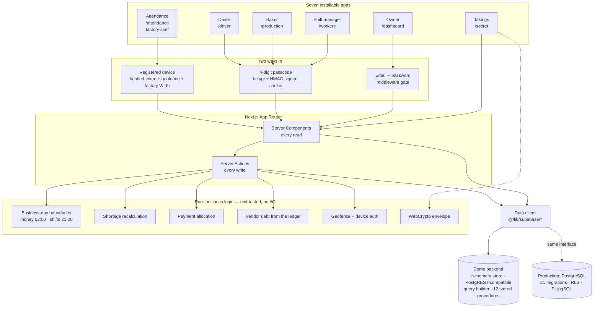
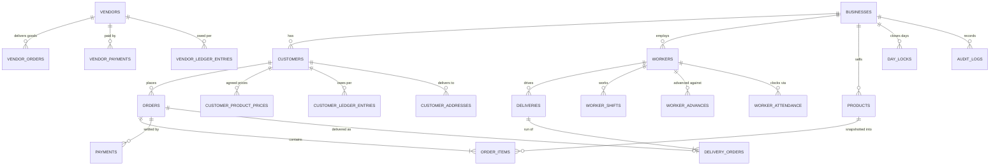
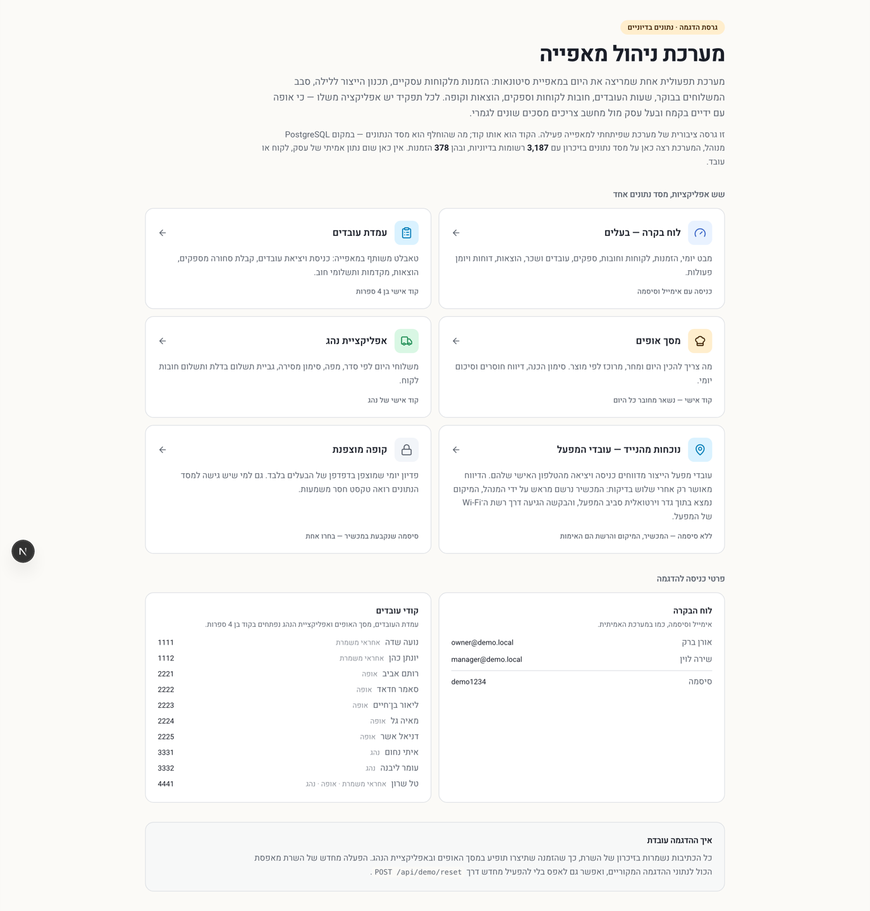
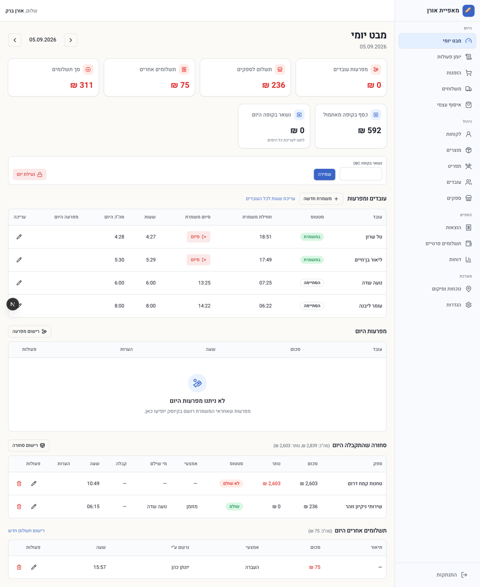
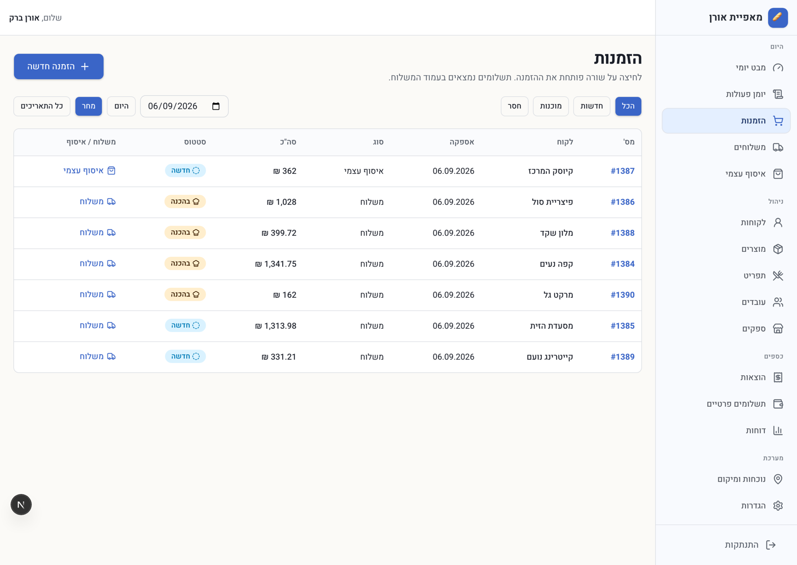
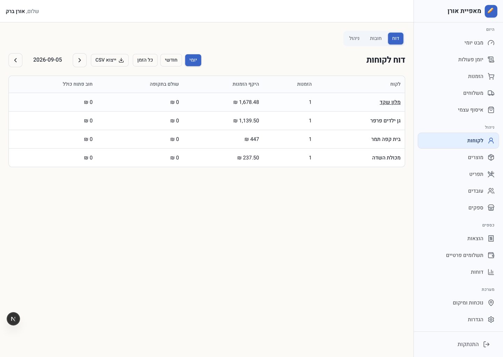
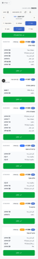
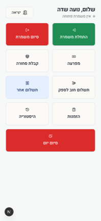

# Bakery Operations Platform

A wholesale bakery is a surprisingly hard business to model. Cash moves in four
directions at once, the working day doesn't start at midnight, half the staff
never touch a computer, and nothing can be allowed to quietly not add up.

This is the system that runs one: orders from business customers, the night's
production plan, the morning delivery run, staff hours and wages, supplier
debts, expenses, and the till at the end of the night — **seven role-specific
apps over one database**.

`Next.js 16` · `React 19` · `TypeScript (strict)` · `Tailwind 4` · Hebrew, RTL

> ### About this repository
>
> This is a **public portfolio build of a system I designed and shipped for a
> working bakery**. The application code is the real thing — the same 38,000
> lines, the same screens, the same business rules.
>
> What was replaced is the backend. The production system runs on managed
> PostgreSQL with row-level security; this build runs on an **in-memory demo
> backend** that implements the same client interface, seeded with a fictional
> dataset. It clones and runs with `npm install && npm run dev`, needs no
> account, no API key and no database, and contains **no real business,
> customer, employee or supplier data of any kind**.
>
> The business it was built for is not identified anywhere in this repository.

---

## Contents

- [Run it](#run-it)
- [Seven apps, one database](#seven-apps-one-database)
- [What each app does](#what-each-app-does)
- [Architecture](#architecture)
- [How the demo backend works](#how-the-demo-backend-works)
- [Engineering decisions worth explaining](#engineering-decisions-worth-explaining)
- [Domain model](#domain-model)
- [Testing](#testing)
- [Screenshots](#screenshots)
- [Production vs this build](#production-vs-this-build)
- [What I'd do next](#what-id-do-next)

---

## Run it

```bash
git clone https://github.com/<your-username>/bakery-operations-platform.git
cd bakery-operations-platform

npm install
npm run dev
```

Open <http://localhost:3000>. The landing page lists every app with the
credentials to get into it. Nothing else to configure — no `.env` file, no
database, no services.

| Command | |
|---|---|
| `npm run dev` | Development server |
| `npm run build` / `npm start` | Production build and serve |
| `npm test` | 111 unit tests |
| `npm run lint` | ESLint |
| `npm run icons` | Regenerate the PWA icon set from the SVG sources |

**Demo credentials** — also printed on the landing page:

| Where | How |
|---|---|
| Owner dashboard | `owner@demo.local` / `demo1234` |
| Workers kiosk (shift manager) | passcode `1111` |
| Production / baker screen | passcode `2221` |
| Driver app | passcode `3331` |

Everything you do is written to the in-memory store, so an order you create in
the dashboard shows up on the baker's screen and then on the driver's run.
Restart the server to reset, or `POST /api/demo/reset` to reset without one.

---

## Seven apps, one database

Each role gets its own installable PWA, its own manifest, and its own way in —
because a baker with flour on their hands and an owner at a laptop need
genuinely different screens. In production each is installed from its own URL
and never sees the others; the landing page in this build exists only so you
can walk through all of them in one sitting.

| App | Who | How they sign in |
|---|---|---|
| `/dashboard` | Owner | Email + password |
| `/workers` | Shift managers, on a shared tablet | 4-digit passcode |
| `/production` | Bakers | Passcode, session lasts the day |
| `/production/takeaway` | Bakers, pickup orders only | Same passcode |
| `/driver` | Delivery drivers | Passcode + delivery list and map |
| `/attendance` | Production-factory staff, on their own phones | Registered device + location + factory Wi-Fi — no login |
| `/secret` | Owner only | Passphrase that never leaves the device |

---

## What each app does

### Owner dashboard — `/dashboard`

The daily board first: money in and out today, who is on shift, goods received,
advances paid, what is left in the register. Then orders, deliveries, customers
and their debts, per-customer price lists, products and the menu, staff hours
and wages, suppliers and their ledgers, expenses, reports by day/month/all-time,
and an append-only activity log of every action anyone took.

### Workers kiosk — `/workers`

A shared tablet on the bakery floor. Clock in and out (for yourself or, as a
shift manager, for someone else), record goods arriving from a supplier, log an
expense, take a wage advance, pay down a supplier debt, and print order slips.
Idles out after 30 seconds — it is a shared device in a public room.

### Production — `/production`

What has to be baked, aggregated across every order for the day so a baker
reads "426 croissants", not twelve order slips. Per-order packing screens,
shortage reporting when a dough fails, a day summary, and an Arabic/Hebrew
toggle because the bench and the office don't share a first language.

### Driver — `/driver`

Today's run in order, a map, mark delivered/partial/failed, collect payment at
the door, and settle a customer's outstanding debt on the spot.

### Attendance — `/attendance`

Staff at the **production factory** clock in and out from their own phones —
there is no shared tablet on that site and no passcode to type.

A clock-in is accepted only if **three independent checks** pass, all of them
server-side:

1. **The device is registered.** An administrator enrols the worker's phone
   beforehand; the phone holds an opaque token whose SHA-256 is all the
   database keeps, and the token is what names the worker.
2. **The location is inside the factory's geofence.** The GPS fix must fall
   within a configurable radius of the site.
3. **The request came over the factory's Wi-Fi.** It must arrive from one of
   the site's registered networks.

The phone proves nothing by itself: it presents a token, and the server decides.
A worker who is no longer active is refused even with a valid device.

### Encrypted takings — `/secret`

The day's revenue, sealed in the owner's browser and stored as opaque text.

---

## Architecture



The dashed line is the point of the whole exercise: **nothing above the data
client knows which backend is underneath it.**

---

## How the demo backend works

Making a system like this public normally means one of two bad options: publish
it with the credentials stripped and watch it fail to boot, or rewrite it as a
toy and publish something that isn't the real thing.

Instead I replaced only the bottom layer. `src/lib/demo-backend/` is a
**drop-in implementation of the database client interface**:

| File | What it is |
|---|---|
| `store.ts` | The database: tables as arrays, a process-level singleton, reset support |
| `seed.ts` | The fictional dataset — generated, deterministic, anchored to today |
| `query.ts` | A PostgREST-compatible query builder: filters, embedded relations, ordering, ranges, counts, `single()`/`maybeSingle()`, insert/update/upsert/delete |
| `filters.ts` | The filter vocabulary — `eq`, `in`, `is`, `or`, `not`, `ilike`, `contains`, … |
| `rpc.ts` | The twelve stored procedures, reimplemented |
| `auth.ts` | Email/password sign-in for the dashboard |
| `storage.ts` | Receipt/proof uploads, served back as placeholders |

Because the interface matches, **the 79 modules and ~500 query calls that talk
to the database were not touched**. The three files under `src/lib/supabase/`
now build a demo client instead of a Supabase one, and that is the entire
migration:

```ts
// src/lib/supabase/server.ts — before
return createServerClient(process.env.NEXT_PUBLIC_SUPABASE_URL!, ...);

// after
return createDemoClient(cookieAdapter);
```

The application therefore exercises real code, not a reimplementation of it —
including its error handling, because the reimplemented procedures raise the
same error codes (`DAY_LOCKED`, `NO_ITEMS`, `PRODUCT_NOT_FOUND`,
`DEBT_PAYMENT_EXISTS`, `OVERPAYMENT`) that the app already catches by name.

The original PostgreSQL schema is still in `supabase/migrations/` — 31
migrations, ~3,900 lines of SQL — because it is a real part of the design work,
and because pointing this build back at a database is a matter of restoring
three files.

---

## Engineering decisions worth explaining

### Money that has to add up

Supplier debt is defined as exactly one thing: the sum of a ledger. Every write
— a delivery of goods, a payment, a correction, a deletion — goes through a
single function so the record, its ledger rows and its audit entry land
together or not at all.

An earlier version wrote them as separate calls and discarded the second
error, which meant a failure between them silently mis-stated what the bakery
owed, with nothing to reconstruct it from. Days can also be locked once counted,
and every financial write is checked against the lock of *the day it belongs
to* — not today's.

### The working day is a business rule, not a clock

The bakery trades past midnight, so "today" can't mean midnight to midnight.
The original boundary was 04:00 — which turned out to sit squarely inside the
morning crew's clock-in rush, filing every baker who started before 04:00 under
the previous day. One worker showed up twice on the same day with 24 hours
between them.

The fix came from measuring 210 real shifts rather than guessing: the only quiet
moment in this bakery's clock is between the night crew's last clock-out (01:21)
and the morning crew's first arrival (02:55). The system now keeps **two**
separate notions of a day — money rolls over at 02:00 so a trading night stays
whole, while a shift starting at 21:00 or later counts as the next day's work,
because the night crew comes in late to bake tomorrow's bread.

Both boundaries are pure functions with their own tests
(`src/lib/db/day-lock.ts`).

### Revenue the developer cannot read

The owner didn't want the day's takings legible to anyone with database access —
including whoever maintains the system. Server-side encryption would have been
theatre, since the key would live next to the data.

So the figures are sealed in the owner's browser with WebCrypto and stored as
opaque text. An envelope scheme — a random data key, itself stored only wrapped
under a PBKDF2-derived key — means changing the passphrase re-wraps one small
blob instead of re-encrypting years of history, and a recovery code is simply a
second wrapping of the same key. The JSON is padded to a fixed width first,
because AES-GCM doesn't hide length and the size of a ciphertext would otherwise
betray the size of the number.

Finding this also meant fixing a leak elsewhere: the audit log had been
recording the same amounts in plaintext, which would have undone the whole
exercise.

### Attendance that doesn't trust the phone

Enrolling a phone is one QR code and one WhatsApp link that are two renderings
of a single one-time token: whichever the worker reaches first registers the
device and kills the other. The owner sets it up by standing in the right place
and pressing a button — no coordinates or IP addresses to type.

### Workers are not auth users

Staff sign in with a 4-digit passcode checked against a bcrypt hash, and get an
HMAC-signed session cookie. All their database access happens server-side; the
privileged client never reaches a browser. The kiosk cookie is deliberately
short and the screen idles out after 30 seconds, because it is a shared tablet
in a room full of people.

### Built for the people using it

Every screen is Hebrew, right-to-left, in the language the staff actually use,
and the baker and driver apps switch to Arabic. Clock times are typed as four
digits rather than picked from a native time widget — which renders in the
browser's own locale and had been showing 12-hour times on a 24-hour business.
Destructive actions confirm. Long shifts turn red.

---

## Domain model



42 tables in all. The two ledger tables are the source of truth for every
balance in the system — there is no `balance` column anywhere, so a wrong
balance is always a wrong *row*, and you can point at it.

Order lines snapshot the product name, unit and price at the moment the order is
taken, so re-pricing the menu next month never rewrites last month's invoice.

---

## Testing

```bash
npm test    # 111 tests
```

- **79 tests carried over from the production system**, covering the parts where
  a bug is expensive: both business-day boundaries, geofencing, the WebCrypto
  envelope, payment allocation, vendor debt, shortage recalculation, delivery
  code formatting and calendar arithmetic.
- **32 tests for the demo backend itself** — the query builder's filter
  vocabulary and embedded relations, `single()` semantics, write behaviour, and
  the stored procedures. Those assert the *invariant*: that creating an order
  moves the customer's balance by exactly the order total, that paying a
  supplier more than it is owed is refused, and that a bill with a later debt
  payment attached cannot be deleted.

One of them is a privacy guard: it dumps the entire seeded database and asserts
that no real-world identifier appears anywhere in it.

---

## Screenshots

### Landing page — every app in one place



### Owner — the daily board



### Orders and customers

| Orders | Customer account |
|---|---|
|  |  |

### The field apps

| Baker | Driver | Workers kiosk |
|---|---|---|
|  |  |  |

---

## Production vs this build

| Production system | This repository |
|---|---|
| Managed PostgreSQL, row-level security per tenant | In-memory store, single tenant |
| PL/pgSQL functions for order creation and vendor ledgers | The same twelve procedures in TypeScript, same error codes |
| Supabase Auth for the owner | Email + password against the seeded profiles |
| Object storage for receipt and proof photos | Uploads accepted, served back as a placeholder |
| Real customers, staff, suppliers and figures | A generated fictional dataset, anchored to today |
| Real brand logos in the PWA icons | Flat SVGs, generated by `npm run icons` |
| Deployed, with a bakery depending on it | Runs locally with two commands |

Nothing is shared between them: no credentials, no environment variables, no
database, no deployment, no records, and no identifying details of the business.

---

## What I'd do next

- **Offline-first field apps.** A driver in a basement loading bay loses signal
  constantly; a service worker with a write queue is the highest-value addition.
- **Route optimisation with time windows.** Several customers have goods-in
  cut-offs, which turns stop ordering into a real problem worth solving.
- **Demand forecasting.** Two years of order history per customer per weekday is
  enough to pre-fill tomorrow's standing orders and flag the ones that look odd.
- **Ingredient inventory.** A recipe per product would turn the production plan
  into a flour, butter and sugar requirement, and connect it to supplier
  ordering.
- **A pluggable data layer.** The demo backend proved the seam exists; making it
  an explicit interface with two implementations would make it a feature rather
  than a fork.

---

## Licence

MIT — see [LICENSE](LICENSE). The demo data is fictional and may be reused
freely.
